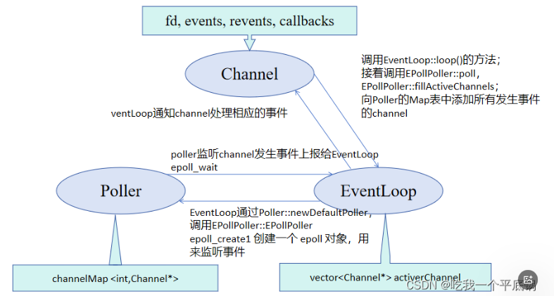

Channel 负责定义文件描述符及其事件，并在事件发生时通过 EventLoop 处理这些事件。
Poller 负责监听 Channel 上的事件，并通过 epoll_wait 函数(EpollPoller类中的poll函数)将事件通知给 EventLoop。
EventLoop 通过调用 Poller 来监听事件，并在事件发生时调用 Channel 的回调函数。

//Channel、EventLoop以及Poller之间的关系

//回调函数的绑定(初始化)以及绑定的是谁(实际执行的是哪个函数)

1.在根目录下创建build文件夹  cd build && cmake .. && make -j4  生成libmymuduo.so
2.进入test文件夹，执行：
      sudo cp /home/czl/Documents/Code/MyMuduo/include/*.h /usr/include/mymuduo/        可以使用#include <mymuduo/.h>导入头文件
     sudo cp /home/czl/Documents/Code/MyMuduo/lib/libmymuduo.so /usr/local/lib/
     g++ testserver.cc -o testserver -lmymuduo -lpthread -g

wulawula
main1
main2
main33